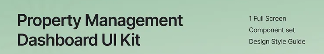

<!-- ========================================================= -->

<!-- Project Banner -->

<!-- Replace with actual image later -->

<!-- ========================================================= -->

<p align="center">
  
</p>

<h1 align="center">Property Manager</h1>

<p align="center">
  Modern Property Management with Local AI Assistance
</p>

<p align="center">


</p>

---

# Overview

Property Manager is a property and tenant management platform designed for landlords, real estate agencies, and property managers.

The system provides tools for:

* Tenant management
* Lease management
* Rent collection
* Property administration
* Financial reporting
* Maintenance tracking

The long-term vision is to integrate a local AI assistant capable of answering property-related questions using natural language and voice interaction.

---

# Screenshots

> Screenshots will be added as the project progresses.

<p align="center">
  
</p>

---

# Architecture

<p align="center">
  
</p>

```text
Browser
    │
    ▼
Frontend (React)
    │
    ▼
Backend (Flask)
    │
    ├── PostgreSQL
    │
    └── Ollama
            │
            ▼
       Local LLM
```

---

# Voice Assistant Vision

<p align="center">
  
</p>

```text
Microphone
    │
    ▼
Faster-Whisper
    │
    ▼
Qwen
    │
    ▼
Tool Calling
    │
    ▼
Application Services
    │
    ▼
PostgreSQL
```

Example interactions:

> Which tenants have not paid rent this month?

> Show all vacant flats.

> How much rent was collected this quarter?

> Record a payment of R4500 from John Smith.

---

# Technology Stack

## Backend

* Python
* Flask
* SQLAlchemy
* PostgreSQL

## Frontend

* React
* TypeScript

## AI

* Ollama
* Qwen
* Faster-Whisper

## Infrastructure

* Docker
* Docker Compose

---

# Project Structure

```text
property-manager/
├── backend/
├── frontend/
├── postgres/
├── ollama/
├── volumes/
├── docker-compose.yml
└── README.md
```

---

# Development Status

## Phase 1 - Infrastructure

* [x] Docker Compose setup
* [x] PostgreSQL container
* [x] Ollama container
* [ ] Flask backend
* [ ] React frontend

## Phase 2 - Core Features

* [ ] Authentication
* [ ] Tenant management
* [ ] Property management
* [ ] Lease management
* [ ] Rent collection

## Phase 3 - Reporting

* [ ] Financial reports
* [ ] Occupancy reports
* [ ] Arrears reports

## Phase 4 - AI Assistant

* [ ] Tool calling
* [ ] Local LLM integration
* [ ] Voice assistant
* [ ] Speech-to-text
* [ ] Text-to-speech

---

# Documentation

| Document     | Description                |
| ------------ | -------------------------- |
| API          | REST API documentation     |
| Database     | Schema and migrations      |
| Deployment   | Docker deployment guide    |
| Architecture | System design and diagrams |

---

# Contributing

Contributions, bug reports, and feature requests are welcome.

Please open an issue before submitting major changes.

---

# License

This project is currently under development.

License information will be added in a future release.
